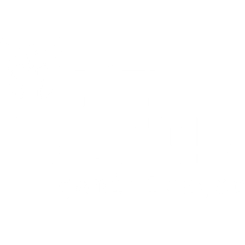

# Lista-de-Tarefas-React

<h4> Lista de tarefas simples desenvolvida durante capacitação da Orc'Estra (Empresa Júnior - UnB)</h4>

  

 
<h3> Habilidades desenvolvidas: </h3>

* Formatação e desenvolvimento web;
* Integração linguagem de programação e HTML;
* Utilização de TypeScript;
* Utilização e treinamento de React.
 

# Linguagens Utilizadas:

  
  
  
  
  

 

# Library's Utilizados:

  
  
  

